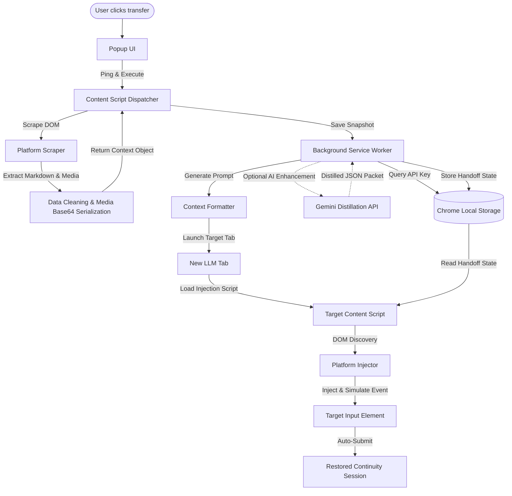
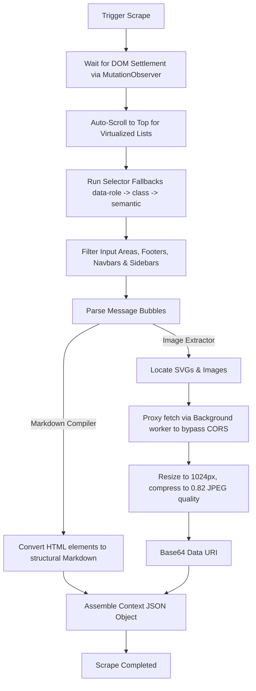
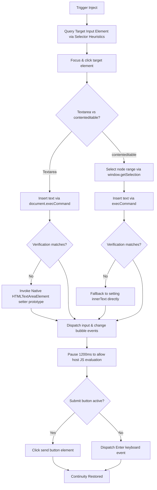

<p align="center">
  
</p>

# Cross Context

### The Universal Context Bridge & Portability Layer for Large Language Models

[](LICENSE)
[](manifest.json)
[](manifest.json)

<p align="center">
  <br>
  <b>Supported Platforms:</b><br><br>
  <a href="https://chatgpt.com"></a>
  <a href="https://claude.ai"></a>
  <a href="https://gemini.google.com"></a>
  <a href="https://grok.com"></a>
  <a href="https://perplexity.ai"></a>
</p>

Cross Context is an open source browser extension and intelligent context portability framework. It enables seamless conversation migration, state restoration, and multi platform continuity across major LLM interfaces without manual copy-pasting or loss of momentum.

---

## 📖 Introduction

In the current era of LLM utility, developers and power users operate in a multi model landscape. Different models excel at different tasks: Claude is preferred for complex codebase refactoring, ChatGPT for fast logical prototyping, Gemini for large context analysis, and Perplexity for real-time web retrieval. 

However, users are constantly bottlenecked by platform specific restrictions such as free-tier usage caps, context window limits, conversation truncation, and vendor lock-in. When a limit is hit, migrating a session to another platform is painful. It requires manual parsing, copying text fragments, re-explaining architectural rules, re-uploading file trees, and re-pasting error logs. 

Cross Context addresses this gap. It serves as a local, privacy-first context portability layer. It reads the current session's DOM, filters out interface noise, constructs a deterministic memory graph, compresses low-priority turns, and generates a structured handoff prompt. This prompt is then dynamically injected into the target platform's input field, allowing the conversation to continue with zero friction.

---

## 🛑 Problem Statement

Modern AI workflows suffer from **context fragmentation**. When you switch from one LLM platform to another, you lose the semantic progress you have built. The friction points include:

1. **Information Loss**: Standard copy-paste procedures skip code block metadata, ignore assistant-versus-user turn structures, and omit critical intermediate reasoning steps.
2. **Cognitive Restart Costs**: Developers spend significant time writing meta-prompts (e.g., "Here is my project background, tech stack, and what we just tried...") just to bring a new LLM up to speed.
3. **Usage Limit Disruptions**: Mid-task rate limits (such as Claude's 5-hour message caps) halt work. Rebuilding the state in ChatGPT or Gemini manually breaks developer flow.
4. **Token Waste**: Copying entire raw conversations wastes input tokens on boilerplate text, duplicate code snippets, and conversational greetings, resulting in higher latency and premature context truncation on the target platform.

---

## 🎯 Vision

The long-term goal of Cross Context is to establish a **universal context layer** for AI interactions. The vision spans:

* **Model Agnostic Memory**: A standard format for serializing conversation state, requirements, preferences, and progress.
* **Semantic Portability**: Decoupling the user's ongoing session memory from any single host interface.
* **Local-First Synchronization**: Creating offline memory stores where users maintain full control over their interaction graphs.
* **Agentic Continuity**: Allowing different specialized autonomous agents to inherit and hand off complex multi-step tasks to one another.

---

## ⚡ Key Features

* **Cross-LLM Context Transfer**: Move conversations dynamically between Claude, ChatGPT, Gemini, Grok, and Perplexity.
* **Intelligent Scraping Engine**: DOM parsing scripts custom-tailored for each LLM interface. They clean out UI chrome, copy buttons, and toolbars before processing.
* **Smart Context Extraction**: Recovers hierarchical markdown structures from raw HTML, preserving code blocks, tables, lists, and headers.
* **AI-Enhanced Summarization**: Optional integration with Gemini's API to distill long transcripts into dense, high-level developer specifications.
* **Deterministic Context Scoring**: Local heuristic algorithm that rates messages based on information density (errors, requirements, decisions, code vs fluff).
* **Concept Deduplication**: Algorithmic deduplication using Jaccard similarity metrics to prevent repeating code blocks or redundant instructions.
* **Memory-Graph Generation**: Builds a local relationship network (nodes and edges) tracking tasks, tech stack, decisions, and bugs.
* **One-Click Handoff & Injection**: Automated workflow that opens the target platform, waits for DOM readiness, and programmatically injects the structured state.
* **Dynamic Scroll-to-Load**: Heuristic viewport controller that scroll-loads virtualized lists in long chat logs to capture full conversation history.
* **Base64 Media Extraction**: Detects, fetches, bypasses CORS, compresses, and base64-encodes SVGs and images within the conversation to preserve visual context.

---

## 🏗️ System Architecture

Cross Context is built as a highly decoupled browser extension utilizing Chrome Extension Manifest V3. The system consists of the following primary layers:

```
┌─────────────────────────────────────────────────────────────────┐
│                           UI Layer                              │
│         Popup UI (popup.js, popup.html, popup.css)             │
└────────────────┬────────────────────────────────────────────────┘
                 │ (Chrome Runtime Messaging)
┌────────────────▼────────────────────────────────────────────────┐
│                        Background Layer                         │
│             Background Service Worker (background.js)           │
│                 ├── Storage Controller (storage.js)             │
│                 └── Gemini API Enhancement Client               │
└────────────────┬────────────────────────────────────────────────┘
                 │ (Script Injection & Port Messaging)
┌────────────────▼────────────────────────────────────────────────┐
│                         Content Script                          │
│            Content Dispatcher & Orchestrator (content.js)       │
│                 ├── Scraping Engine (scrapers/*)                │
│                 └── Injection Engine (injectors/*)              │
└─────────────────────────────────────────────────────────────────┘
```

### Component Details
1. **Popup UI**: The user interface. It detects if the active tab is a supported LLM, allows configuring settings (like Gemini API keys), lists saved session snapshots, and coordinates transfer targets.
2. **Background Service Worker**: The orchestrator. It manages the chrome local storage backend, fetches external images to bypass CORS restriction, and runs the asynchronous Gemini API enhancement pipeline to summarize raw histories in the background.
3. **Content Script Dispatcher**: Injected into the target LLM webpages. It listens for messages from the popup, triggers target scrapers or injectors, and manipulates the page DOM.
4. **Scraping Engine**: Platform-specific scripts that parse specialized DOM trees (e.g., ChatGPT's conversation articles vs Claude's message containers).
5. **Injection Engine**: Specialized modules designed to insert text into complex editor interfaces (ProseMirror, textarea, draft.js) and simulate human submission events.
6. **Context Intelligence & Formatting Engine**: Common utilities that score messages, perform deduplication, extract key files, build semantic memory graphs, and format final prompts.

---

## 📊 Architecture Diagrams

### 1. High-Level Architecture
This diagram traces the flow from scraping the source LLM interface to injecting into the target LLM workspace:



### 2. Scraping Engine Workflow
The scraping pipeline handles scrolling, DOM readiness, sanitization, and asset optimization:



### 3. Injection Engine Pipeline
Injecting into dynamic single-page applications (SPAs) requires navigating custom document models:



---

## 🔁 Detailed Workflow

1. **Session Scraping Initiated**: The user clicks "Scrape Context" in the extension popup while viewing an active LLM chat.
2. **DOM Stabilization**: The script invokes a `MutationObserver` on the viewport to wait for DOM mutations to settle, ensuring streaming answers are completed.
3. **Virtualized List Loading**: Heuristic scrolls are executed to load older segments of the thread.
4. **DOM Extraction**: Content script queries message nodes using priority selectors, filtering navigation bars and textboxes.
5. **Markdown Reconstruction**: The HTML nodes are translated into clean Markdown, preserving tables, code blocks, lists, and formatting.
6. **Media Optimization**: SVG assets are rendered to Canvas and compiled into PNG data URIs. Inline image URLs are retrieved via the background proxy, optimized to 1024px JPEG, and converted to base64.
7. **Graph Generation & Deduplication**: The context intelligence engine builds a local memory graph and runs Jaccard similarity metrics to strip repeating code or text.
8. **Handoff Packaging**: A JSON transfer packet containing context metadata, messages, priorities, and code snippets is saved to local storage.
9. **Target Launch**: The background script opens a tab loading the user-chosen target LLM.
10. **Target Injection**: Upon tab load completion, the injection engine locates the editor, simulates a focus event, overrides the native input setter (to bypass framework virtual DOM virtual-state checks), and enters the formatted handoff prompt.
11. **Session Restored**: The page submits the prompt, and the new LLM resumes the task without breaking pair-programming context.

---

## 🧠 Context Engineering System

The context engineering module handles optimization and compression to ensure the transfer prompt is highly effective and fits easily within typical LLM system contexts.

### Priority Heuristics
The local `ContextIntelligenceEngine` runs a keyword classifier on every scraped turn:

* **High-Priority Match (Score +1.5 to +3.0)**: Matches patterns: `requirement`, `architecture`, `technical decision`, `todo`, `unresolved`, `error`, `bug`, `config`, or code blocks (` ``` `).
* **Low-Priority Match (Score -2.0)**: Matches patterns: `hello`, `hi`, `thank you`, `awesome`, `fluff`, or basic affirmations like `ok`, `yes`.
* **Baseline Scores**: Users receive a default baseline of 6, while Assistant responses start at 5. The engine caps scores between 1 and 10. Messages scoring $\ge 6$ are added to priority memory.

### Algorithmic Deduplication
To prevent transferring multiple versions of a file that was iteratively debugged, the system uses a **Jaccard Similarity Coefficient** analyzer:

$$J(A, B) = \frac{|A \cap B|}{|A \cup B|}$$

For any two text fragments $A$ and $B$, the engine splits the strings into sets of words (minimum length of 3 characters, ignoring case and symbols). If the similarity index exceeds `0.45`, or if one fragment is a substring inclusion of the other, the shorter version is discarded. This keeps only the most complete, updated code or architectural instructions in the packet.

### Memory Graph Assembly
The engine creates a structured network:
* **Nodes**: Representing tech stack variables (e.g., `React`, `Next.js`), active tasks (extracted via `TODO` parser), architecture decisions (`we will use`, `decided to`), and issues (`blocked by`, `fails with`).
* **Edges**: Relationships such as `IMPLEMENTED_WITH`, `DEPENDS_ON`, `BLOCKED_BY`, or `RELATED_TO`.
* **Sub-graph Traversals**: When formatting the final continuity payload, the engine crawls paths up to 2 hops out from the active focus node to structure a dense context summary.

---

## 🕷️ Scraping Engine Details

Each AI platform presents a unique UI structure. The scraping scripts use custom selectors and structural heuristics:

```js
// Example ChatGPT Selector Fallbacks
const SELECTORS = [
  '[data-message-author-role]',
  'article',
  '.whitespace-pre-wrap',
  '.markdown'
];
```

### Platform Scrapers
* **ChatGPT**: Reads `data-message-author-role` directly. Recovers prose via `.markdown` classes and prompts via `.whitespace-pre-wrap` fields.
* **Claude**: Selects message blocks using `font-claude-message` or `.font-user-message`. Handles structured text trees carefully to isolate user attachments from the textual prompt.
* **Gemini**: Traverses elements matching `message-content` tags. Extracts formatted text, removing secondary suggestion chips.
* **Grok**: Scrapes conversation divs on `grok.com` or `x.com/i/grok`. Filters out social feed elements.
* **Perplexity**: Isolates search steps and answer boxes, converting citations (e.g. `sup` tags) into inline markdown links.

### Shadow DOM and Virtual Lists
For interfaces nested inside Shadow Roots, the scraper uses a recursive traversal script. If it detects a virtualized scroll container, it reads the viewport heights, scroll position, and performs a controlled, layout-friendly scroll to the top to force rendering of lazy-loaded DOM elements before running extraction.

---

## 💉 Injection Engine Details

Inserting context into modern Single Page Applications (SPAs) built with React or Svelte cannot be done by simply setting `input.value = text`. The frameworks maintain internal state machines that will overwrite the input field when the user types or clicks submit.

To solve this, the injection script performs the following operations:
1. **Selection & Focus**: It focuses and dispatches a mouse click to the input element.
2. **Text Simulation**: It attempts insertion using `document.execCommand('insertText', false, text)`. This fires standard React text-listener states naturally.
3. **Native Setters Callback**: If `execCommand` fails or the element is not updated, the injector grabs the native input or textarea property setter from the window prototype chain:
   ```js
   const setter = Object.getOwnPropertyDescriptor(window.HTMLTextAreaElement.prototype, 'value').set;
   setter.call(input, text);
   ```
4. **Event Dispatching**: The injector dispatches synthetic `input` and `change` events with bubble propagation enabled to force the virtual DOM state to sync.
5. **Execution Simulation**: It waits 1200ms for state reconciliation, locates the submit button, verifies it is not disabled, and clicks it. If the button is not present, it dispatches an `Enter` keyboard event to submit the context.

---

## 🧠 AI Enhancement Pipeline

If a user configures a Gemini API key in the extension settings, Cross Context changes its default scraping action from a deterministic parser to an active AI Distillation flow.

```
                  ┌──────────────────────────────┐
                  │ Scraped Raw Conversation DOM │
                  └──────────────┬───────────────┘
                                 │
                                 ▼
                  ┌──────────────────────────────┐
                  │ Token-Optimization & Fluff   │
                  │   Filtering in Service Worker│
                  └──────────────┬───────────────┘
                                 │
                                 ▼
                  ┌──────────────────────────────┐
                  │  Gemini API Schema Payload   │
                  └──────────────┬───────────────┘
                                 │
                                 ▼
                  ┌──────────────────────────────┐
                  │ Distilled Structured Context │
                  │       JSON Generation        │
                  └──────────────────────────────┘
```

1. **Preprocessing**: The background script compresses the transcript, stripping conversational greetings from old turns and truncating code blocks older than 8 turns to save tokens.
2. **System Instruction Guardrails**: The background script calls the Gemini API with structured instructions, directing it to build a concise JSON summary containing architectural decisions, current tasks, error listings, and preferences.
3. **Structured Response Schema**: Using Gemini's JSON schema constraints, the model produces a standardized payload, ensuring the output matches the expected properties.
4. **Adaptive Prompt Formatting**: Based on the conversation type (e.g., Coding, Debugging, Brainstorming), the extension selects a custom prompt template, generating a highly tailored handoff message.

---

## 🛠️ Tech Stack

* **Extension Architecture**: WebExtensions Manifest Version 3 (compatible with Google Chrome, Microsoft Edge, Brave, and Opera).
* **UI Layer**: Vanilla HTML5, CSS3 Custom Properties (variables), and ES modules. No external UI libraries to keep the bundle footprint minimal.
* **Storage Provider**: `chrome.storage.local` API for fast local snapshots.
* **Core Languages**: Modern Vanilla ECMAScript (ES6+) with async-await concurrency patterns.
* **API Integration**: Native HTTPS fetch calling Google AI Studio Gemini API endpoints.

---

## 📂 Folder Structure

```text
cross-context/
├── manifest.json              # Extension metadata, permissions, and entry configurations
├── background.js              # Service worker managing state, proxy fetches, and Gemini API calls
├── LICENSE                    # Software license terms
├── icons/                     # Brand image files in various sizes
│   ├── icon16.png
│   ├── icon48.png
│   └── icon128.png
├── content/                   # Scripts executing inside target LLM page contexts
│   ├── content.js             # Main orchestrator, DOM observer, and media compressor
│   ├── scrapers/              # Specialized scrapers for extraction
│   │   ├── chatgpt.js
│   │   ├── claude.js
│   │   ├── gemini.js
│   │   ├── grok.js
│   │   └── perplexity.js
│   └── injectors/             # Specialized injectors for inserting prompts
│       ├── chatgpt.js
│       ├── claude.js
│       ├── gemini.js
│       ├── grok.js
│       └── perplexity.js
├── popup/                     # User interface layout and styles
│   ├── popup.html             # HTML layout for popup interface
│   ├── popup.css              # Custom styled popup window CSS
│   └── popup.js               # Event handlers and local state controllers for UI
└── utils/                     # Common utility modules
    ├── formatter.js           # Memory graph logic, heuristics, and prompt formatters
    └── storage.js             # Local Chrome storage wrappers
```

---

## 💾 Installation Guide

Since the extension is under development, load it locally using Developer Mode:

1. **Clone the Repository**:
   ```bash
   git clone https://github.com/yourusername/cross-context.git
   cd cross-context
   ```
2. **Open Extensions Dashboard**:
   Open Google Chrome or a Chromium-based browser and navigate to `chrome://extensions/`.
3. **Enable Developer Mode**:
   Toggle the **Developer mode** switch in the top-right corner to **ON**.
4. **Load the Extension Folder**:
   * Click **Load unpacked** in the top-left corner.
   * Select the root directory containing the `manifest.json` file.
5. **Verify Installation**:
   The Cross Context icon should now be visible in your extensions toolbar. Click it to open the control panel.

---

## 🚀 Usage Guide

### Real-World Scenario: Migrating from Claude to ChatGPT

```
   CLAUDE (Usage Limit Reached)                   CHATGPT (Continuous Flow)
 ┌───────────────────────────────┐              ┌───────────────────────────────┐
 │ Scraped conversation:         │              │                               │
 │ - React frontend              │   Transfer   │ Injected handoff prompt:      │
 │ - Redux state mismatch        │ ───────────> │ - Target file: store.js       │
 │ - Active bug in store.js      │              │ - Error log: TypeError...     │
 │ - Attempted solution failed   │              │ - Reconstructed memory graph  │
 └───────────────────────────────┘              └───────────────────────────────┘
```

1. **Work in Source Model**: Imagine you are developing a project in Claude. You have discussed your tech stack, created React components, hit a `TypeError` in your state manager, and attempted two different bug fixes.
2. **Reach Platform Limits**: You hit Claude's hourly limit.
3. **Capture State**:
   * Click the **Cross Context** icon in the toolbar.
   * Select **Scrape Context**. The extension will parse the DOM and save a structured snapshot.
4. **Handoff Target selection**:
   * In the popup, choose **ChatGPT** as your target.
   * Click **Transfer**.
5. **Context Restored**:
   * Cross Context opens a new ChatGPT tab.
   * The injection script focuses the prompt textbox and inputs the structured handoff packet.
   * ChatGPT processes the packet and outputs: *"I see we are debugging a React project using Redux, and we need to resolve the state mismatch in store.js after the reducer change failed. Let's fix this now..."*

---

## 📄 Example Context Packet

Below is the structure of the serialized context packet generated by the `ContextIntelligenceEngine`:

```json
{
  "system_context": "Deterministic State Restoration & Continuity Protocol — Version 2.0",
  "priority_memory": [
    "[Score 9/10] TypeError: Cannot read properties of undefined (reading 'reducer') at store.js:24",
    "[Score 8/10] We need to make sure the root reducer has the userSlice registered correctly.",
    "[Score 7/10] Attempted to fix by importing userReducer from './userSlice.js' but it resulted in a circular dependency."
  ],
  "active_tasks": [
    "Fix state mismatch in store.js",
    "Add test suite for root reducer loading"
  ],
  "unresolved_issues": [
    "Circular dependency during slice registration",
    "store.js error on application bootstrap"
  ],
  "important_decisions": [
    "Decided to use Redux Toolkit slice architecture",
    "Using configureStore from @reduxjs/toolkit"
  ],
  "execution_context": {
    "topics_discussed": ["react", "redux", "javascript", "typescript"],
    "problems_solved": ["Configured devTools setting for dev environments"],
    "approaches_to_avoid": ["Direct store mutation in root element"],
    "current_focus": "Fix state mismatch in store.js"
  },
  "user_preferences": [
    "Prefers functional components and hooks",
    "Uses TypeScript strict mode"
  ]
}
```

---

## ⚡ Performance Considerations

* **DOM Layout Thrashing**: Scraping queries run through a temporary styling phase that hides non-content elements in one pass. This allows extracting raw text via `innerText` without triggering multiple browser reflow passes.
* **Token Overhead Management**: Distillation limits code snippet arrays to a maximum of 5 blocks, and older code sections are truncated to keep the handoff prompt length optimized.
* **Concurrent Image Processing**: When base64 image data is compiled, processing is throttled to 3 concurrent tasks to prevent UI lag.
* **Chrome Local Storage Limits**: Local storage holds a maximum of 10 session snapshots, preventing quota errors and keeping memory overhead low.

---

## 🔒 Security & Privacy

Privacy is a core design principle:
* **Zero External Hosting**: All data is processed entirely within the local sandbox. There is no remote database, backend server, or usage tracking.
* **Self-Contained Storage**: Snapshots are saved locally via `chrome.storage.local` and never leave the device.
* **Minimal Host Permissions**: Host permissions are limited strictly to the required LLM web domains (`claude.ai`, `chatgpt.com`, `gemini.google.com`, `grok.com`, `x.com`, `perplexity.ai`) to capture and inject text locally.

---

## 🛠️ Challenges & Engineering Decisions

1. **Dynamic DOM Structures**: AI companies update their class names and page structures frequently. We addressed this by relying on robust data attributes (like `data-message-author-role`) and fallback tag-based patterns instead of brittle class selectors.
2. **SPA State Overrides**: Modern UI frameworks will clear programmatic inputs when state sync is bypassed. Overriding the native HTML input prototypes ensures the virtual DOM registers the injected text correctly.
3. **Character vs Token Optimization**: Lacking a local token calculator, the extension uses character limits ($80,000$ characters, $\approx 20,000$ tokens) as a guardrail to keep handoff packages within safe boundaries.

---

## 🗺️ Future Roadmap

* **Vector Database Integration**: Store past sessions in local vector stores using WASM-compiled sqlite-vss to allow semantic searches.
* **Visual Context Timeline**: A UI timeline visualizing how project structure, decisions, and bugs have evolved over the conversation.
* **Automated Sync Cloud**: Optional end-to-end encrypted synchronization across user devices.
* **Context Chain Workspaces**: Multi-session workspaces mapping distinct threads into a unified project context.
* **Multi-Agent Orchestration**: Dynamic handoff loops that trigger specific local models to run diagnostics or tests.

---

## 💡 Why This Project Matters

Cross Context establishes a vendor-agnostic portability layer, giving users the freedom to choose the best model for the job. It mitigates platform lock-in, improves productivity, and moves us closer to a future where user interaction data is open, portable, and secure.

---

## 🤝 Contributing

Contributions are welcome! If you would like to help improve the project:

1. Fork the repository.
2. Create a feature branch: `git checkout -b feature/amazing-feature`.
3. Commit your changes: `git commit -m 'Add amazing feature'`.
4. Push to the branch: `git push origin feature/amazing-feature`.
5. Open a Pull Request.

---

## 📄 License

Distributed under the MIT License. See [LICENSE](LICENSE) for details.

---

## 👥 Credits

* Developed by [Shriraj888](https://github.com/Shriraj888).

---

## 🏆 Acknowledgements

* Inspired by the developer community's demand for multi-model workflows.
* Thanks to the open-source contributors of Chromium extension templates.
