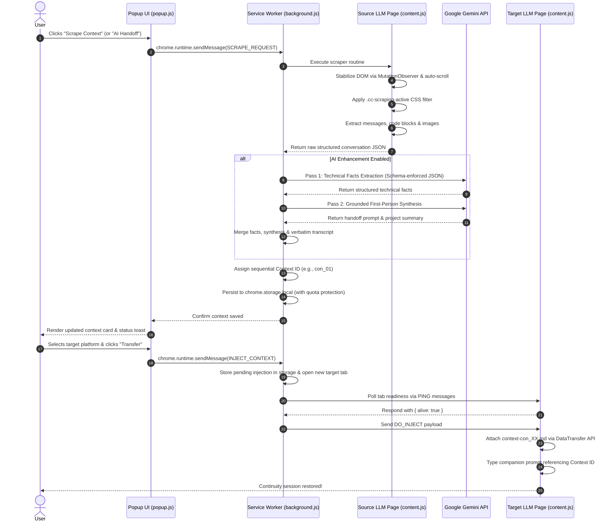

# System Architecture

Cross Context is an open-source browser extension built on **Chrome Extension Manifest V3 (MV3)**. It operates as a local, client-side context portability engine designed to scrape, structure, and inject rich conversation states across major LLM interfaces without external cloud dependencies.

---

## 🏛️ High-Level Architectural Model

The extension is organized into three primary decoupling layers:

```
┌────────────────────────────────────────────────────────────────────────┐
│                               UI Layer                                 │
│          Popup Window (popup.html, popup.js, popup.css)                │
│   • Active platform detection & radar scan console                     │
│   • Saved contexts list, search, multi-session merger                  │
│   • In-memory Markdown preview (`context.md`) & token estimator       │
│   • Settings modal (Gemini API configuration & model selector)         │
└───────────────────────────────────┬────────────────────────────────────┘
                                    │ (chrome.runtime.sendMessage)
┌───────────────────────────────────▼────────────────────────────────────┐
│                           Background Layer                             │
│               Service Worker Orchestrator (background.js)              │
│   • Central message router & transaction coordinator                   │
│   • Storage management & auto-recovery eviction engine                 │
│   • Two-pass Gemini API enhancement & distillation pipeline            │
│   • Cross-tab injection lifecycle coordinator (`pollAndInject`)        │
│   • Secure CORS image fetch proxy with SSRF validation                 │
└───────────────────────────────────┬────────────────────────────────────┘
                                    │ (chrome.scripting / chrome.tabs)
┌───────────────────────────────────▼────────────────────────────────────┐
│                            Content Layer                               │
│             Single-File Content Script (content/content.js)            │
│   • Platform detection (Claude, ChatGPT, Gemini, Grok, Perplexity)    │
│   • Resilient scraping engine (DOM mutation settling & sanitization)   │
│   • Dual-mode injection engine (file drop & fallback text input)       │
│   • Shadow DOM floating preview confirmation card                      │
└────────────────────────────────────────────────────────────────────────┘
```

---

## 🔄 End-to-End Information Flow



---

## 🧩 Component Responsibilities

### 1. Popup Interface (`popup/`)
- **Aesthetics & Micro-interactions:** Built using pure CSS custom properties with an Obsidian Dark (`#0B0E14`) and Electric Cyan (`#00F2FE`) design system.
- **Dynamic Platform Detection:** Automatically inspects the current active browser tab to identify whether the user is viewing a supported platform, activating the appropriate scraping controls.
- **Context Management:** Supports searching, filtering by source platform, copying Markdown snapshots, downloading raw `.md` files, and merging multiple saved contexts into unified handoff briefs.
- **Settings Controller:** Safely stores Gemini API keys and preferred model choices (`gemini-3.5-flash`, `gemini-3.6-flash`, or custom models) into local storage.

### 2. Background Service Worker (`background.js`)
- **Persistent Operations:** Acts as the central event router. Manifest V3 service workers terminate when idle, so all state transitions are managed as atomic promises.
- **Storage Subsystem:** Wraps `chrome.storage.local`. Automatically caps saved sessions to the configured maximum (default: 10), evicting older sessions and warning the user via toast events.
- **Storage Quota Auto-Recovery:** If Chrome's storage quota is approached, `evictImagesForQuota()` strips heavy Base64 image payloads from older records while preserving text transcripts.
- **SSRF-Guarded Image Proxy:** Fetches remote images referenced in chat threads to bypass page CORS restrictions. Validates every URL with `isSafeImageUrl()` to prevent access to private IP spaces or cloud metadata addresses (`169.254.169.254`).

### 3. Content Script Dispatcher (`content/content.js`)
- **Monolithic Bundling:** Because Manifest V3 disallows dynamic ES module imports inside content scripts, all scrapers, injectors, and DOM resilience utilities are bundled into a single file.
- **Zero-Thrashing DOM Scraping:** Injects temporary CSS styles (`.cc-scraping-active`) to hide action buttons, SVGs, and toolbars before running `innerText` queries. This avoids repeated browser reflows and layout thrashing.
- **Shadow DOM Isolation:** Renders floating confirmation and status cards inside an isolated Shadow Root (`#cross-context-overlay`), preventing target page CSS styles from corrupting the extension UI.

---

## 🔐 Security & Permission Boundaries

Cross Context is designed with a minimal attack surface:

| Dimension | Implementation |
|-----------|----------------|
| **External Hosting** | **Zero.** No external servers, telemetry collectors, or remote analytics are used. |
| **Permissions** | Strictly scoped to `activeTab`, `storage`, and `scripting`. Broad `tabs` permissions are avoided. |
| **Host Scoping** | `host_permissions` are strictly restricted to supported LLM origins (`claude.ai`, `chatgpt.com`, `gemini.google.com`, `grok.com`, `x.com`, `x.ai`, `perplexity.ai`). |
| **Fingerprinting Resistance** | `web_accessible_resources` are restricted solely to the designated platform domains to prevent arbitrary third-party websites from detecting the extension. |
| **Content Security Policy** | Default MV3 strict CSP is observed. No `eval()`, no remote code loading, no dynamic scripts. |
