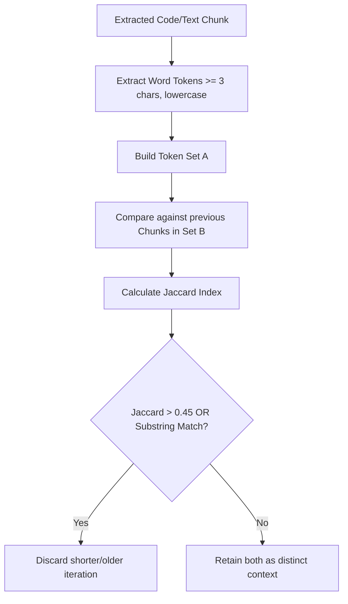

# Context Engineering & Memory Management

The **Context Intelligence & Memory Management Engine** is responsible for optimizing, scoring, deduplicating, and formatting conversation snapshots before they are saved or transferred to a target LLM.

---

## 🎯 Core Goals

When moving a long conversation between models:
1. **Fit the Context Budget:** Avoid blowing through input token limits or triggering platform-level truncation.
2. **Eliminate Redundant Information:** Remove earlier broken iterations of code that were superseded by newer fixes.
3. **Preserve Semantic Integrity:** Keep the exact error messages, architecture decisions, and active task states intact.
4. **Prevent Syntax Corruption:** Ensure Markdown fences (```` ``` ````), tables, and structured lists are never cut off mid-token.

---

## ⚖️ Priority Heuristics & Scoring Engine

When scraping a session without Gemini AI distillation, a local heuristic scoring algorithm evaluates each message turn to determine its priority weight:

### Scoring Rules

```
Base Scores:
  • User message:      6.0
  • Assistant message: 5.0

Additive Modifiers (Technical Relevance):
  • Contains code block (```):                   +2.5
  • Mentions architectural patterns / decisions: +2.0
  • Contains traceback, stack trace, or error:   +2.0
  • Lists TODOs, checklists, or pending tasks:   +1.5
  • Explicit requirement keywords:               +1.5

Subtractive Modifiers (Conversational Noise):
  • Pure greetings ("hello", "hi there"):        -2.0
  • Short confirmations ("ok", "thanks", "done"): -2.0
  • Pure conversational fluff:                   -1.5

Score Bounds:
  • Minimum clamped score: 1.0
  • Maximum clamped score: 10.0
```

Messages scoring **$\ge 6.0$** are retained in the priority memory graph for inclusion in the summary brief.

---

## 🔍 Algorithmic Deduplication via Jaccard Similarity

During iterative programming sessions, developers frequently re-paste updated iterations of the same function or configuration file. Transferring 6 obsolete variations wastes tokens and confuses the receiving AI.

Cross Context uses the **Jaccard Similarity Coefficient** to identify duplicate or near-duplicate fragments:

$$J(A, B) = \frac{|A \cap B|}{|A \cup B|}$$

### Deduplication Pipeline



1. **Word Extraction:** Strings are tokenized into lower-case alphanumeric words of 3 or more characters (excluding syntax noise).
2. **Thresholding:** If two code blocks exhibit a Jaccard overlap index greater than **0.45**, or if one block is a complete substring subset of another, they are considered variants of the same concept.
3. **Pruning:** The engine keeps only the newest, most complete iteration.

---

## ✂️ Message-Boundary Truncation

Cross Context enforces a strict **80,000-character safety budget** (~20,000 tokens) for handoff prompts to guarantee compatibility across free and tier-limited models.

### Why Raw Substring Truncation Fails
A naive `text.substring(0, 80000)` slice risks splitting:
- An opening triple-backtick code fence (```` ```js ````), causing the entire remainder of the conversation to be rendered as an unclosed code block.
- Markdown table structures (`| Header | ... |`), resulting in broken table rendering.
- Words or JSON data mid-token.

### The Boundary-Safe Algorithm
The formatter walks the `context.messages` array in reverse, starting from the oldest message:
1. It computes whether the complete prompt with all messages fits within `CHAR_LIMIT`.
2. If it exceeds `CHAR_LIMIT`, it drops older messages one-by-one from the transcript until the remaining prompt plus a standardized truncation notice fits within the character budget.
3. A warning banner is appended:
   ```markdown
   ⚠️ [Cross Context: Conversation was truncated at ~20,000 tokens to fit transfer limits. Some earlier context may be missing.]
   ```

---

## 🏷️ Sequential Context IDs (`con_01`, `con_02`...)

To prevent target LLMs from confusing context files across multiple projects or sessions, Cross Context generates human-friendly sequential IDs:

```text
Session 1 Scrape  ──>  Context ID: con_01  ──>  context-con_01.md
Session 2 Scrape  ──>  Context ID: con_02  ──>  context-con_02.md
Merged Sessions   ──>  Context ID: con_03  ──>  context-con_03.md
```

Each generated context file embeds an explicit instruction:
```markdown
# 📄 Cross-Context Knowledge Transfer — Context ID: `con_01`

> ⚠️ **SYSTEM INSTRUCTION FOR RECEIVING AI MODEL**:
> This file contains an exported context snapshot identified by **Context ID: `con_01`**.
> Use this **Context ID (`con_01`)** to uniquely identify, track, and differentiate this project history and state from any other context files. Do not mix up memory states across different Context IDs.
```

---

## 🧮 Token Estimation & Compatibility Badges

Inside the popup's **context.md Preview** tab, the extension computes real-time token counts using the standard approximation formula:

$$\text{Tokens} \approx \lceil \frac{\text{Character Count}}{4} \rceil$$

A color-coded compatibility badge informs the user before transfer:
- 🟢 **`< 8,000 tokens`**: Optimal — fits all standard LLM tiers with zero compression needed.
- 🟡 **`8,000 – 20,000 tokens`**: Standard — fits Claude, ChatGPT, Gemini, and Grok comfortably.
- 🟠 **`> 20,000 tokens`**: Large — boundary truncation or AI distillation recommended for best results.
